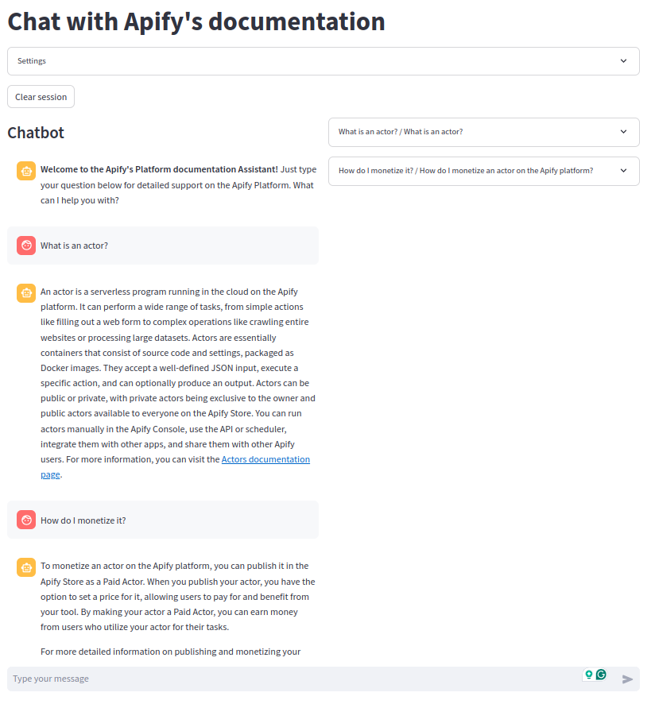

# 📚 Docbot - Chat with your documentation

[](https://github.com/jirispilka/docbot/blob/main/LICENSE)

Docbot is a chatbot that answers questions about documentation.

## 🎯 Key Features

- Query documentation.
  - Context-aware conversation handling.
  - Capable of handling large conversations.
  - Automatically provides relevant documentation links in responses whenever applicable.

## Application overview

The Streamlit application includes three key components:

- **Project Setup**:
  - Crawl websites using Apify's [Website Content Crawler](https://apify.com/apify/website-content-crawler).
  - Save crawled data to Pinecone using Apify's [Pinecone integration](https://apify.com/apify/pinecone-integration) (create chunks and compute embeddings).

- **Chat Interface**:
  - LangChain to manage several steps for retrieval-augmented generation.
  - Manages chat history.
  - Rewrites user queries based on chat history.
  - Retrieves context for the rewritten query.
  - Generates answers through LLM using prompts, queries, chat history, and context.
  - Updates chat history with LLM responses.

- **Debugging Tools**:
  - **Retrieval Debugging**: Allows search in Pinecone database.
  - **Chat Debugging**: Provides a specific interface for testing and troubleshooting chat interactions.

## ⚙️ Technologies used

- Python 3.11
- Apify - [Website Content Crawler](https://apify.com/apify/website-content-crawler)
- Apify - [Pinecone integration](https://apify.com/apify/pinecone-integration)
- LangChain
- Pinecone
- OpenAI - Embeddings
- OpenAI - Large Language Models
- Streamlit UI
- Docker image `python:3.11-slim-bookworm`

## 💾 Run (Requires docker compose)

The Streamlit application can be run using a Docker container.

1. **Set up environment**:
   - Update/create `.env` with all required variables (see [.env.example](.env.example)).

2. **Build Docker images (using DOCKER_BUILDKIT) and run containers**:
   ```shell
   DOCKER_BUILDKIT=1 docker-compose up
   ```

3. **Access streamlit app**:
   - Visit `http://localhost:8501`

4. **Chat with your documentation**



## Development

- Pre-commit
- Pytest
- Ruff

Install all dependencies using poetry
```shell
poetry install
```

Run tests
```shell
poetry run pytest
```
